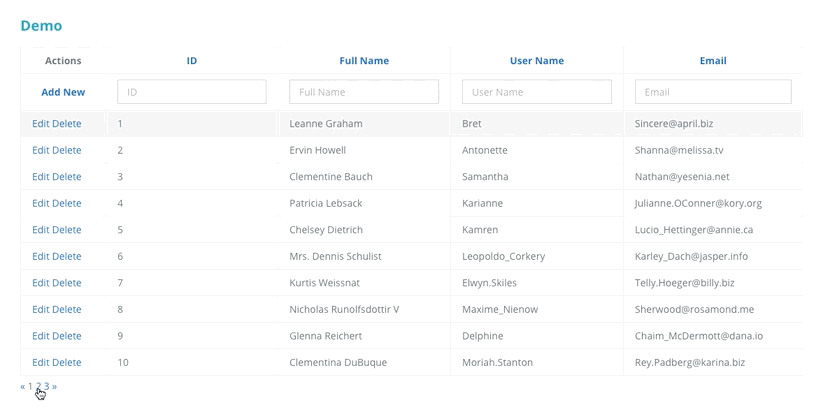

[](https://travis-ci.org/akveo/ng2-smart-table)

# Angular Smart Table Component

ng2-smart-table component made with :heart:  by [Akveo team](http://akveo.com/). Follow us on [Twitter](https://twitter.com/akveo_inc) to get latest news about this component first!

### Demo

<a target="_blank" href="https://akveo.github.io/ng2-smart-table/">Live Demo</a>



## Installation

The library is available as npm package, so all you need to do is to run the following command:

```
npm install --save ng2-smart-table
```

This command will create a record in your `package.json` file and install the package into the npm modules folder.

## Minimal Setup Example

First thing you need to do is to import the ng2-smart-table directives into your component.

```

import { Ng2SmartTableModule } from 'ng2-smart-table';

```

Then register it by adding to the list of directives of your module:

```
// ...

@NgModule({
  imports: [
    // ...
    
    Ng2SmartTableModule,
    
    // ...
  ],
  declarations: [ ... ]
})
// ...
```

Now, we need to configure the table and add it into the template. The only <strong>required</strong> setting for the component to start working is a columns configuration.
Let's register <i>settings</i> property inside of the component where we want to have the table and configure some columns [Settings documentation](https://akveo.github.io/ng2-smart-table/#/documentation):
    
```
settings = {
  columns: {
    id: {
      title: 'ID'
    },
    name: {
      title: 'Full Name'
    },
    username: {
      title: 'User Name'
    },
    email: {
      title: 'Email'
    }
  }
};
```

Finally let's put the ng2-smart-table component inside of the template:

```
// ...

@Component({
  template: `
    <ng2-smart-table [settings]="settings"></ng2-smart-table>
  `
})
// ...
```
At this step you will have a minimal configured table. All functions are available by default and you don't need to configure them anyhow, so now you can add/edit/delete rows, sort or filter the table, etc.
 
Still it seems like something is missing... Right, there is no data in the table by default. To add some, let's create an array property with a list of objects in the component. Please note that object keys are the same as in the columns configuration.

```
data = [
  {
    id: 1,
    name: "Leanne Graham",
    username: "Bret",
    email: "Sincere@april.biz"
  },
  {
    id: 2,
    name: "Ervin Howell",
    username: "Antonette",
    email: "Shanna@melissa.tv"
  },
  
  // ... list of items
  
  {
    id: 11,
    name: "Nicholas DuBuque",
    username: "Nicholas.Stanton",
    email: "Rey.Padberg@rosamond.biz"
  }
];
```

And pass the data to the table:

```
// ...

@Component({
  template: `
    <ng2-smart-table [settings]="settings" [source]="data"></ng2-smart-table>
  `
})
// ...
```

Now you have some data in the table.
 
## Further Documentation
Installation, customization and other useful articles: https://akveo.github.io/ng2-smart-table/

## How can I support developers?
- Star our GitHub repo :star:
- Create pull requests, submit bugs, suggest new features or documentation updates :wrench:
- Follow us on [Twitter](https://twitter.com/akveo_inc) :feet:
- Like our page on [Facebook](https://www.facebook.com/akveo/) :thumbsup:

## Can I hire you guys?
Yes!  Visit [our homepage](http://akveo.com/) or simply leave us a note to [contact@akveo.com](mailto:contact@akveo.com). We will be happy to work with you!

## Features
* Local data source (Server/API DataSource is on its way)
* Filtering
* Sorting
* Pagination
* Inline Add/Edit/Delete
* Flexible event model

## License
[MIT](LICENSE.txt) license.

## Special thanks to our awesome contributors!

[](https://github.com/nnixaa)[](https://github.com/lexzhukov)[](https://github.com/damnko)[](https://github.com/Tibing)[](https://github.com/Ezeon)[](https://github.com/Deilan)[](https://github.com/hoswey)[](https://github.com/stacyakveo)[](https://github.com/Akshaymisal5)[](https://github.com/geneeblack)[](https://github.com/vvandoorne)[](https://github.com/ananthhh)[](https://github.com/bis-sb)[](https://github.com/tadashi-aikawa)

[](https://github.com/nureha)[](https://github.com/vlupu10)[](https://github.com/zhouhao27)[](https://github.com/hkb1990)[](https://github.com/liaosong)[](https://github.com/ktriek)

### From akveo

Enjoy :metal:
We're always happy to hear your feedback!
